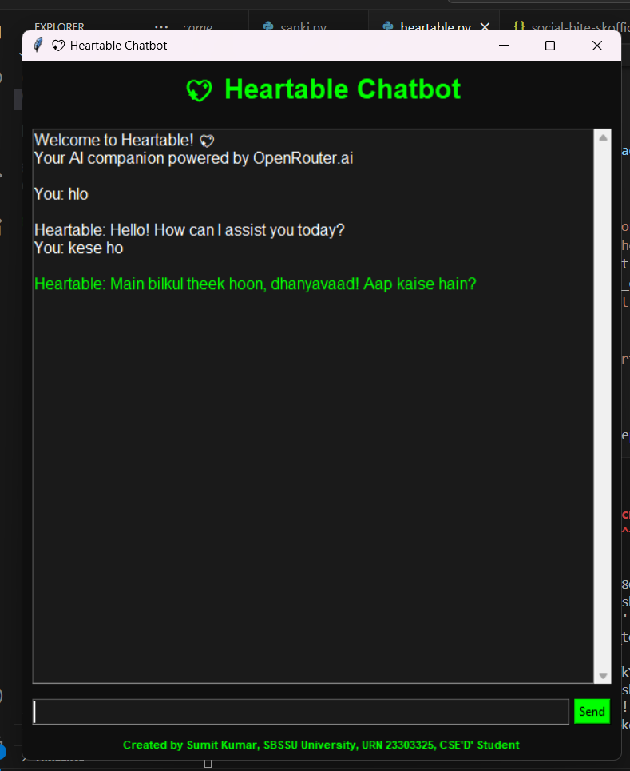

  

<h1 align="center">💖 Heartable Chatbot</h1>
<h3 align="center">Dark-themed AI Chatbot built with Python & Tkinter</h3>

  
  
  
  

---

## About the Project 🚀
Heartable is a **AI chatbot** that runs on **Python Tkinter GUI**, communicating via **OpenRouter.ai API**.  

Features:  
- Real-time chat interface with **typing animation** (`. .. ... ....`)  
- **Green-colored AI replies** for a modern coder look  
- **Dark black theme** for UI  
- Threaded messaging to prevent GUI freeze  

**All code handcrafted by Sumit Kumar. All copyrights reserved.**  

---

## How It Works ⚡
1. User types a message → Enter / Send  
2. **Typing animation** appears (`. .. ... ....`)  
3. Message sent to **OpenRouter.ai API**  
4. AI response received → displayed in **green**  
5. Typing animation stops  

---

## Author ✨
- **Name:** Sumit Kumar  
- **University:** SBSSU, URN 23303325, CSE'D' Student  
- **Skills:** Python, AI, Tkinter, GUI, Songwriting, Shayarii  

---

**Demo:**  

  

---

## License 📄
All rights reserved to **Sumit Kumar**. Unauthorized use or reproduction prohibited.  

  Made with ❤️ by <b>Sumit Kumar</b>

